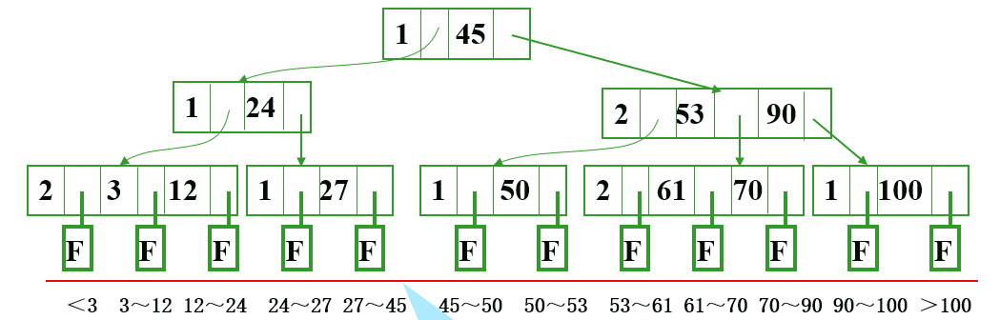

# B 树

外查找法

## B-树

### 结构

每个结点包含：(n, A~0~, K~1~, A~1~, ... K~n~, A~n~)

其中：
    n：关键字个数；
    K：关键字（即数据），且有序；
    A：指向子树的指针，对于其值有关系：K~i~ < A~i~ < K~i+1~

叶子节点一般为 null，表示查找失败，真正的数据都在内节点上。

### 查找

包含两种基本操作：
1. 在 B-树 中找节点：在磁盘上进行，找到节点后读入内存中
2. 在节点中找关键字：在内存中顺序或折半查找关键字，找到后返回输出
3. 若找到叶子节点，则失败

## B+ 树

* 每个节点内元素个数变为 n，每个元素表示其指向的子树节点中最大的关键字值
* 真正的数据都在叶子节点上，树结构仅作索引，因此可以从根结点索引查找，也可以直接遍历叶子节点组成的链表从小到大顺序查找

