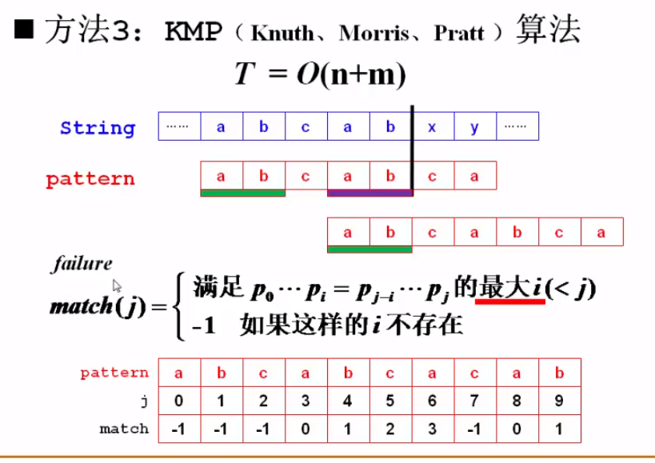
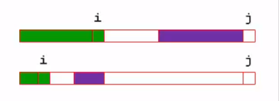
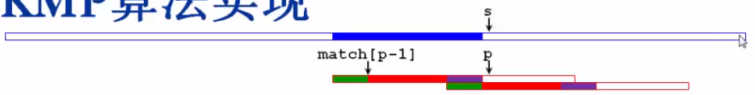
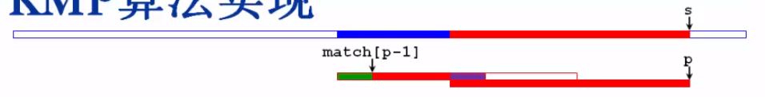

# KMP

基本思路：比较原字符串 str 与模式字符串 pattern 到某一位置不再相同时，不是将 pattern 与 str 上一次匹配开始位置的下一个位置重新开始匹配，而是对 pattern 从当前最大程度与 pattern 首段相同的位置开始。

## match 函数



KMP 需首先对模式串进行处理，找出其内部符合一定条件的子串，具体为：从首字符 s~0~ 之后，每个字符 x~i~ 与首字符进行比较，若不相同则比较首二字符 s~0~、s~1~ 和 x~i-1~、x~i~，以此类推，最终 match 值为相等时的**最大的**字符的位置 i，如下图



```C++
int match[maxn]; // match 函数
void buildMatch(char* pattern) {
	// 对模式串 pattern 构造 match
	memset(match, -1, sizeof(match));
	int plen = strlen(pattern);
	match[0] = -1;
	// 开始迭代（原理见上图）：
	for (int p = 1; p < plen; p++) {
		int i = match[p - 1]; // 获取 p 之前位置的 match 值
		while (i >= 0 && pattern[p] != pattern[i + 1]) {
			i = match[i];
		}
		if (i == -1) {
			// 说明没找到
			match[p] = -1;
		}
		else {
			match[p] = i + 1;
		}
	}
}
```

## 开始匹配



将原字符串 string 一直与模式串 pattern 比较，当指针 s 和 p 所指的不同时，可知 p-1 处的 match 值为 match[p-1]，即 p-1 之前的一段字符串与 pattern 开头的一段是匹配的，所以可以直接跳过从 s+1 开始的重新匹配，而直接从 s+1 与 match[p-1] 开始比较。

为何可以直接跳过中间一部分而继续匹配呢？：因为在 match 中取的是**最大**的 i。



```C++
// int match[maxn]; // match 函数
int KMP(char *str, char *pattern) {
	int slen = strlen(str), plen = strlen(pattern);
	if (slen < plen) {
		return -1;
	}
    buildMatch(pattern); // 预处理 pattern 生成 match 值
	int s = 0, p = 0;
	while (s < slen && p < plen) {
		if (str[s] == pattern[p]) {
			s++; p++;
		}
		else if (p > 0) {
			// 因为要取 p-1，所以判断 p>0
			p = match[p - 1] + 1; // 调整指针 p 的位置
		}
		else {
			// 此时 pattern 的首字符与 s 都不同
			s++;
		}
	}
	return p == plen ? s - plen : -1;
}
```

## 测试

```C++
int main() {
	char* str = "abcdefghijklmnopqrstuvwxyz";
	char ptn[100];
	while (scanf("%s", ptn)!=EOF) {
		cout << KMP(str, ptn) << endl;
	}
	
	return 0;
}
```


